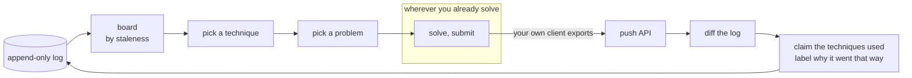
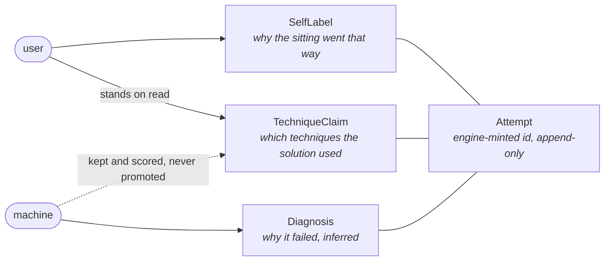

# algo-coach

AI coaching layer for deliberate practice of algorithmic problem-solving:
spaced repetition over a technique-mastery model, with LLM-based attribution of
what a solution actually did.

Most practice tools schedule *problems*. algo-coach models mastery of
*techniques* — what a solution used is read from the code rather than inferred
from a problem's tags, and scheduling will target the weakest technique rather
than the oldest problem. Procedural-skill SRS, not fact SRS — built for
experienced engineers restoring fluency, not beginners learning concepts.

## What it looks like

Per-technique standing, derived from a real backlog of 1,785 ingested attempts.
Nothing here is stored: every column is computed from the append-only log on
read.

```
$ algo-coach board

technique             attempts  solved   last               labels
backtracking          144       110/144  2026-07-22 (28d)
binary-search         198       105/198  2026-07-19 (31d)
binary-search-tree    45        28/45    2025-10-10 (312d)
dynamic-programming   367       226/367  2026-07-28 (22d)
greedy                80        42/80    2026-06-30 (50d)
monotonic-stack       83        47/83    2026-07-28 (22d)
shortest-path         18        12/18    2026-06-24 (56d)
string-matching       8         6/8      2025-01-16 (580d)
...
101 attempts grouped nowhere — no technique resolved
```

The attribution classifier, scored against an adjudicated eval set. The model
is a cheap open one, constrained to each problem's own candidate tags, and
every divergence is printed rather than averaged away.

```
$ algo-coach score

openai/gpt-oss-120b, effort medium, temperature 0.0, via deepinfra/bf16
56/62 exact (90%)          # the whole claimed set, per attempt
169/175 (96.6%)            # per candidate technique, claim or not
0 read, 62 reused          # stored readings answer; nothing re-asked

technique             attempts  exact  missed  over
backtracking          8         7      0       0
dynamic-programming   8         7      1       0
hashing               7         7      0       2
...
b505a8d07e86403ea1f5df7f6ff4892e
  you: dynamic-programming monotonic-stack
  it:  monotonic-stack
```

## Where it stands

| | |
|---|---|
| Ingested attempts | 1,785, from real daily practice |
| Technique vocabulary | 27 codes, each with what earns it and the near miss it is confused with |
| Eval set | 62 attempts, hand-claimed blind, then adjudicated against a frontier reader |
| Attribution | 90% exact set match, 96.6% per decision, on a 120B open model |
| Cards | 9 authored |
| Tests | 585 |

Built: push API, technique vocabulary, attribution classifier, drill loop.
In progress: cards. Not started: failure-mode diagnosis, mastery estimation,
scheduling. Sequencing lives in [`docs/ROADMAP.md`](docs/ROADMAP.md).

## Core loop, as built



The engine calls no external platform and mints no attempt: it waits for a
push and diffs its own log, which is exact because it knows what was already
there. Diagnosis and scheduling close this loop later; today the user picks
what to drill and the board says what is stale.

## Design

[`docs/architecture/README.md`](docs/architecture/README.md) is the primary
design document — the concepts, boundaries and invariants, and the reasons
behind them.

What is keyed to an attempt, and who may write it:



The load-bearing ones:

- **[The log is append-only.](docs/architecture/README.md#invariants)** No
  record is revised or removed in place, so component boundaries can be
  refactored and the record schema cannot. The schema runs a phase ahead of the
  features on purpose.
- **[Identity is the engine's.](docs/architecture/README.md#problems)** A client
  pushes external ids; the engine mints its own and resolves references at the
  boundary, so the log stays readable without the platform that produced it.
- **[The user's record stands over the machine's](docs/architecture/README.md#technique-claims)**
  answer to the same question, whichever was written later. What the machine
  wrote is kept and scored, never discarded and never promoted.
- **[Aggregates are derived views](docs/architecture/README.md#invariants)**,
  never stored truth — the board, a card's ladder, mastery.
- **[No third-party problem statements or test cases in git](docs/architecture/README.md#repo-constraints)**,
  in any repo. The engine contacts no external platform, and no platform client
  lives here.

Two features worth reading the doc for:

- **[Technique attribution](docs/architecture/README.md#technique-claims)** —
  which techniques a solution used, read from the code by a prompted
  classifier, because no training data exists for that label: public corpora
  tag *problems*, not solutions. Constrained to the problem's own tags, scored
  against hand claims by set equality per technique, and every reading records
  the model, the effort, the endpoint it was pinned to, the temperature, the
  digest of what was sent and the call that sent it — so two configurations are
  compared over the attempts both read, rather than each over its own.
- **[Cards](docs/architecture/README.md#cards)** — teaching content per
  technique: a recognition cue, what to read, and the templates to reproduce
  from memory. A card names no problem; it carries a selector, and its ladder
  resolves against the corpus.

## Commands

```
uv run algo-coach <command>
```

| Command | What it does |
|---|---|
| `push attempts\|problems` | ingest records your own client exports |
| `seed` | seed authored cards into the store |
| `board` | per-technique standing: attempts, solved, recency, labels |
| `drill` | pick a technique, then a problem, then record what came back |
| `claim` | hand-label which techniques a stored attempt used |
| `classify` | claim stored attempts with the classifier |
| `match` | which problems exercise a card's templates |
| `score` | the classifier against the hand claims, per technique |
| `movement` | how far the classifier's claims move the board off the tags |

## Where things are

```
src/algo_coach/schema/       the record contracts — the public part
src/algo_coach/techniques/   the vocabulary: 27 codes, each with its criterion
src/algo_coach/{board,claims,ingest,log,calls,matches}/
docs/architecture/README.md  concepts, boundaries, invariants
docs/{ROADMAP,TODO}.md       sequencing, and what is open
.claude/skills/card-author/  the skill that authors cards
data/                        your attempts and solutions — never committed
```

## Your data stays yours

Attempt logs, solutions and card content live under `data/` and `content/`,
both gitignored. The schema is public; the data is not.

## Development

```
uv sync
uv run pytest
```

Conventions in [`CLAUDE.md`](CLAUDE.md). Git hooks in `.githooks/`, enabled once
with `git config core.hooksPath .githooks`.

## License

Apache-2.0.
