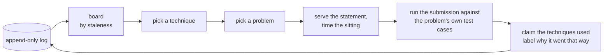
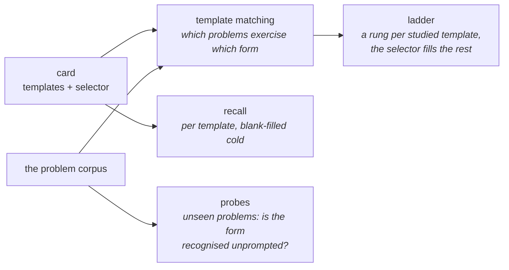

# algo-coach

AI coaching layer for deliberate practice of algorithmic problem-solving:
spaced repetition over a technique-mastery model, with LLM-based attribution of
what a solution actually did.

Most practice tools schedule *problems*. algo-coach models mastery of
*techniques*. What a solution used is read from the code by a model, not
inferred from a problem's tags. Scheduling will target the weakest technique
rather than the oldest problem. Procedural-skill SRS, not fact SRS: built for
experienced engineers restoring fluency, not beginners learning concepts.

The interesting part is not that an LLM is in the loop. It is what the log does
with what the LLM said. Every reading is stored with the configuration that
produced it, scored against hand claims, and outranked by the user's own record
forever.

## Where the model sits

Three places, and nothing is trained anywhere in the engine:

- **Attribution** — a prompted classifier reads the *solution* and names the
  techniques it used, choosing among the problem's own candidate tags. No
  training data exists for that label. Public corpora tag problems, not
  solutions, so a trained model would predict the tag fallback it is meant to
  improve on.
- **Template matching** — which problems exercise which form of a card, read
  from the statement, because a tag says what a problem is *about* and not
  which form solves it.
- **Card authoring** — a skill turns notes into structured cards; every code
  template is checked against a brute force before it lands.

And three rules on top of them:

- **The user's record stands over the machine's**, whichever was written later.
  A machine reading of an attempt the user already claimed is kept and scored,
  never promoted.
- **Every reading is identified by its configuration**: model, effort, the
  endpoint it was pinned to, the temperature, the digest of the exact prompt
  that attempt was sent, and the call that sent it. Two configurations are
  compared over the attempts *both* read, never each over its own.
- **Readings are greedy, and the noise floor is measured.** Repeating a
  configuration flips 0.5–2.2% of decisions. A one- or two-attempt gap between
  models is therefore unreadable, and is not read.

Models are reached through [OpenRouter](https://openrouter.ai) as the single
transport: one chat-completions shape for every provider, a schema-enforcing
endpoint required rather than optional, fallbacks off so a model id resolves to
one backend, and the serving provider recorded on the call. Adding a model is a
string. Adding a provider is a base URL.

## What it looks like

Per-technique standing, derived from a real backlog of 1,785 attempts. Nothing
here is stored: every column is computed from the append-only log on read.

```
$ algo-coach board

technique             attempts  solved   last               labels
backtracking          144       110/144  2026-07-22 (28d)
binary-search         198       105/198  2026-07-19 (31d)
binary-search-tree    45        28/45    2025-10-10 (312d)
dynamic-programming   367       226/367  2026-07-28 (22d)
greedy                80        42/80    2026-06-30 (50d)
monotonic-stack       83        47/83    2026-07-28 (22d)
shortest-path         18        12/18    2026-06-24 (56d)
string-matching       8         6/8      2025-01-16 (580d)
...
101 attempts grouped nowhere — no technique resolved
```

Classifiers against the hand-claimed eval set — several at once, over the
attempts all of them read, with every divergence printed rather than averaged
away.

```
$ algo-coach score --stored --model openai/gpt-oss-120b ... --model moonshotai/kimi-k3 ...

61 of 62 hand-claimed attempts read by all

                    gpt-oss-120b     gemma-4-31b-it   glm-5.2          kimi-k3
exact               55/61 (90%)      60/61 (98%)      57/61 (93%)      59/61 (97%)
per decision        167/173 (96.5%)  172/173 (99.4%)  169/173 (97.7%)  171/173 (98.8%)
read/reused         0/62             0/61             0/62             0/61
named no candidate  0                1                0                1

5cf707249a5e427b9322e6b62c067526
  you:            sorting union-find
  gpt-oss-120b:   hashing sorting union-find
  gemma-4-31b-it: sorting union-find
  glm-5.2:        sorting union-find
  kimi-k3:        sorting union-find
```

## Early evaluation

The eval set is 62 attempts. They were claimed by hand blind, then read by a
frontier model as a scored configuration. Every divergence was resolved one at
a time, by editing the criterion or by editing the claim, until the frontier
disagreed with nothing. That stopping signal is what makes the set a reference
two readers reached rather than one reader's consistency.

Classifiers against it, greedy, each pinned to one endpoint. The adjudicator is
listed first and is not a candidate — its 100% is construction, since the gold
is its own labels wherever the hand pass did not overturn them.

| Classifier | Pinned endpoint | Tokens in→out | $/1M in→out | Exact set match | Per decision | $ per 1k decisions |
|---|---|---|---|---|---|---|
| `anthropic/claude-opus-5` *(adjudicator)* | `anthropic` | 1,410 → 77 | 5.00 → 25.00 | 60/60 (100%) | 171/171 (100.0%) | 3.15 |
| `google/gemma-4-31b-it` | `coreweave/bf16` | 884 → 713 | 0.10 → 0.34 | 59/60 (98%) | 170/171 (99.4%) | 0.12 |
| `moonshotai/kimi-k3` | `deepinfra/bf16` | 1,006 → 54 | 2.85 → 14.25 | 58/60 (97%) | 169/171 (98.8%) | 1.28 |
| `z-ai/glm-5.2` | `gmicloud/fp8` | 923 → 186 | 0.74 → 2.33 | 56/60 (93%) | 167/171 (97.7%) | 0.39 |
| `openai/gpt-oss-120b` | `deepinfra/bf16` | 864 → 406 | 0.04 → 0.17 | 54/60 (90%) | 165/171 (96.5%) | 0.04 |
| `anthropic/claude-sonnet-5` | `anthropic` | 1,409 → 56 | 2.00 → 10.00 | 51/60 (85%) | 162/171 (94.7%) | 1.19 |

Tokens are the measured mean per attempt on this set, from the call log; prices
are the pinned endpoint's on OpenRouter, read 2026-08-20. A full pass over the
62-attempt set costs $0.56 on the adjudicator, $0.02 on `gemma-4-31b-it` and
$0.006 on `gpt-oss-120b`.

Two results, and the second is why the table is worth keeping:

- **`gemma-4-31b-it` lands within 0.6 points of the adjudicator's per-decision
  agreement at a twenty-sixth of the price.** That is what decides which
  classifier the engine runs.
- **Size does not order this task.** A mid-tier frontier model places last,
  nine attempts behind a 31B open one and well outside the noise floor.
  Reading which technique a solution used is a rulebook-application problem. A
  model that applies the criteria as written beats one that reasons around
  them.

Read honestly, and with the caveats the tool prints:

- **n = 60**, the attempts every configuration in the table read at the current
  criteria text. The score command computes that denominator rather than
  letting each model be graded on its own sample. A criteria edit changes the
  digest of the attempts it reaches, so a reading taken before it is stale, and
  is re-asked rather than quietly counted.
- **The endpoint is part of the reading.** A model id resolves to as many
  builds as there are endpoints serving it, and quantization changes the
  weights. So a configuration is pinned, and the same model on two endpoints is
  two columns rather than one mixed key.
- **Adjacent rows are inside the noise floor.** Repeating one configuration
  flips 0.5–2.2% of decisions, so a one- or two-attempt difference is not a
  ranking. The span between the best and the worst candidate is eight attempts,
  which clears the floor by a wide margin.
- **Two numbers, because one number would hide a failure mode.** Set equality
  per attempt catches the classifier that names every candidate. Per-decision
  agreement credits correctly declining a code, and keeps a per-candidate error
  from compounding over the candidate count.
- **What the set cannot show** is a classifier right where the frontier was
  wrong. That is the cost of a fixed reference, and it is accepted.

For scale, on the calibration set: that pass helped write the criteria, so it
measures applicability rather than quality. Four sizes of frontier model
laddered 90/95/98/99% per decision, with the top three within one label of each
other. The cheap models above land in that upper band on the frozen set, which
is why the engine runs them rather than the frontier.

## Where it stands

| | |
|---|---|
| Attempts | 1,785, from real daily practice |
| Problems | ~4k, each with the statement matching reads |
| Technique vocabulary | 27 codes, each with what earns it and the near miss it is confused with |
| Eval set | 62 attempts, hand-claimed blind, adjudicated against a frontier reader |
| Attribution | 85–98% exact set match across five classifiers (n=60), at $0.04–3.15 per 1k decisions |
| Cards | 9 authored |
| Model calls logged | 2,045, each with its prompt, provenance and timings |
| Tests | 615 |

Built: technique vocabulary, attribution classifier, cards, template matching.
In progress: the engine writing its own problems. Not started: failure-mode
diagnosis, mastery estimation, scheduling. Sequencing lives in
[`docs/ROADMAP.md`](docs/ROADMAP.md).

## Core loop



The engine serves, times and judges. Everything the loop reads is local to it:
the problem, the test cases that decide it, and the log. Nothing is fetched
from an external platform, and no third-party client sits in the loop.

The board, the claim and the label run today. Writing the problems is next, and
the sitting the engine witnesses follows it.

## Cards — how a technique gets studied

The board says which technique is weak. A card says what to do about it. Not an
ability estimate and not a problem list: a card is one technique's study unit —
the cue that should fire, what to read, the forms to reproduce from memory, and
a selector the problems to solve are drawn by.

```
monotonic-stack                                  9 cards authored
  trigger   next/previous greater element, or a span bounded by a neighbour
  brief     what to read before solving
  templates next-greater · accumulate while popping ·
            stack plus DP over subarrays · histogram rectangle with a sentinel
  selector  technique=monotonic-stack, difficulty=[medium, hard], size=7
```

**A card names no problem.** It carries the selector, and the ladder of
problems is resolved against whatever corpus the engine holds. So a card ships
anywhere, and the same card teaches from your backlog or someone else's.



Why it is shaped this way:

- **The unit of recall is the template, not the card.** A card's forms are
  learned and lost separately, and a card-level number would average them
  together and show neither. A hinted pass is recorded as hinted, or a decaying
  form scores the same as a fluent one.
- **Coverage is derived, not authored.** The ladder must exercise every studied
  form, and a tag says what a problem is *about*, not which form solves it. So
  which problems exercise which template is read from the statement and stored
  per pair, negatives included. A studied form no problem matches is a reported
  gap, never a quietly shorter ladder.
- **Recall fluency is not solving fluency.** Reproducing a form cold is not
  recognising it unprompted. A probe — an unseen problem, no card in view —
  asks the second question. The gap between the two is exactly the false
  fluency that blocked practice trains.

**Where it stands:** the card record, the authoring skill and its nine cards,
seeding, the template matcher and the hand-annotation prompt are built. Nine
cards against ~4k problems pre-filter to ~2.8k questions and ~14k pair
verdicts, none read yet. Next: the annotated reference itself and the matcher's
score against it, then ladder resolution, card runs, and the recall trainer.
Item by item in [`docs/TODO.md`](docs/TODO.md), phase 4a.

## Design

[`docs/architecture/README.md`](docs/architecture/README.md) is the primary
design document — the concepts, boundaries and invariants, and the reasons
behind them.

What is keyed to an attempt, and who may write it:


The load-bearing ones:

- **[The log is append-only.](docs/architecture/README.md#invariants)** No
  record is revised or removed in place. Component boundaries can therefore be
  refactored, and the record schema cannot. The schema runs a phase ahead of
  the features on purpose.
- **[Identity is the engine's.](docs/architecture/README.md#problems)** Every
  reference in an append-only record is one the engine minted, so the log stays
  readable on its own.
- **[The user's record stands over the machine's](docs/architecture/README.md#technique-claims)**
  answer to the same question, whichever was written later. What the machine
  wrote is kept and scored, never discarded and never promoted.
- **[Aggregates are derived views](docs/architecture/README.md#invariants)**,
  never stored truth — the board, a card's ladder, mastery.
- **[No third-party problem statements or test cases in git](docs/architecture/README.md#repo-constraints)**,
  in any repo. The engine contacts no external platform, and no platform client
  lives here.

If you read one section, read **[technique
claims](docs/architecture/README.md#technique-claims)**: what a reading is, why
it is stored even when it can never stand, and what identifies one. Then
**[template matches](docs/architecture/README.md#template-matches)**, which
makes the same argument for a corpus that grows.

## Commands

```
uv run algo-coach <command>
```

| Command | What it does |
|---|---|
| `seed` | seed authored cards into the store |
| `board` | per-technique standing: attempts, solved, recency, labels |
| `drill` | pick a technique, then a problem, then record what came back |
| `claim` | hand-label which techniques a stored attempt used |
| `classify` | claim stored attempts with the classifier |
| `match` | which problems exercise a card's templates |
| `score` | the classifier against the hand claims, per technique |
| `movement` | how far the classifier's claims move the board off the fallback |

## Where things are

```
src/algo_coach/schema/       the record contracts — the public part
src/algo_coach/techniques/   the vocabulary: 27 codes, each with its criterion
src/algo_coach/claims/       the attribution classifier and its scoring
src/algo_coach/matches/      which problems exercise which card template
src/algo_coach/calls/        the model transport (OpenRouter) and the call log
src/algo_coach/board/        the per-technique view, derived on read
src/algo_coach/{log,cards,problems}/
docs/architecture/README.md  concepts, boundaries, invariants
docs/{ROADMAP,TODO}.md       sequencing, and what is open
.claude/skills/card-author/  the skill that authors cards
data/                        your attempts and solutions — never committed
```

## Your data stays yours

Attempt logs, solutions and card content live under `data/` and `content/`,
both gitignored. The schema is public; the data is not.

## Development

```
uv sync
uv run pytest
```

Conventions in [`CLAUDE.md`](CLAUDE.md). Git hooks in `.githooks/`, enabled once
with `git config core.hooksPath .githooks`.

## License

Apache-2.0.
