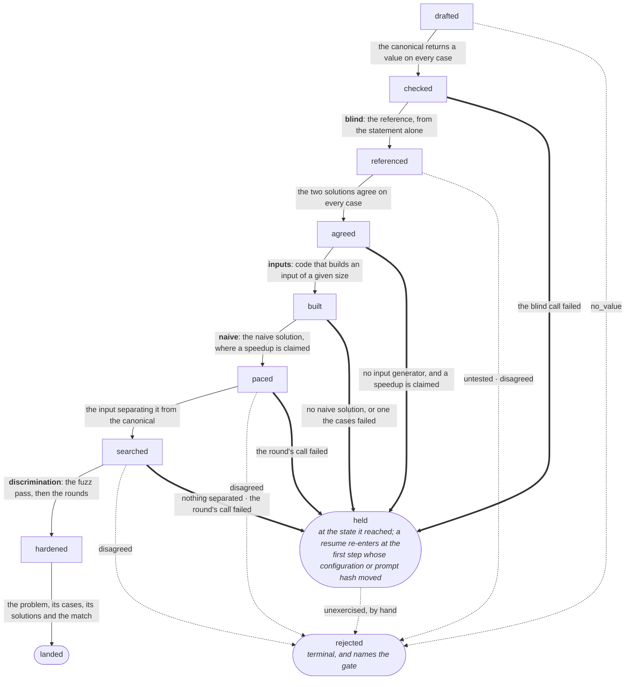

# Flows

Sequences. The other files say what the system holds and where it ends. A
flow says in what order, and what each step may not do.

## Generating a problem

A problem, its test cases and its solutions are written across five calls.
The order matters because each step can reject what came before.

1. The target: a template, naming the form the problem must be solvable by, or
   a technique, naming only the skill.
2. The statement, the canonical solution and the first test cases, from one
   call.
3. The canonical runs, and its outputs are read against the expected values
   the same call declared.
4. The reference solution, from the statement alone.
5. The reference runs, and the two solutions' outputs are settled: they agree
   on every case, or the draft is rejected.
6. Code that builds an input of a given size and seed, from the statement
   alone.
7. A deliberately naive solution, from the statement and the form it may not
   use, on a template that claims a speedup.
8. The smallest input separating that solution from the canonical under the
   cap is searched for.
9. Mutants of the canonical run against the cases, then against inputs that
   code builds. A call asks for the cases that kill whichever mutant survived
   both, and the ones that killed are appended to the set.
10. The case at the separating size is appended after them.
11. All of it lands together, with the template match the generation asserts
    on its canonical.

- **Problems for one template are written one at a time.** Each call is shown
  the statements the form already has, so two in flight would be shown the same
  list and could write the same problem twice. Concurrency saves minutes and
  costs the diversity the target exists to enforce.
- **A draft lands only once every gate has passed.** A draft failing any step
  stops there, and only one that passed every gate becomes a problem. The
  draft is kept where it stopped rather than deleted, so a fixed step can
  resume from there.
- **The reference is written blind.** Shown the canonical, the reference would
  inherit that solution's reading of the statement. Agreement would then show
  only that one model is consistent. Blind, agreement is evidence that the
  statement has one reading, and disagreement on any case rejects the
  draft.
- **The naive solution is written the opposite way**, and told the form it may
  not use. The naive solution settles no case and rejects no draft, so what
  the naive site is shown cannot reach a verdict. `corpus.md` gives what the
  naive solution may never do.
- **The generator's own expected values are a reading, not a gate.** The call
  that wrote the canonical also declared what each case returns, so the two
  share one reading of the statement, and a contradiction between them is that
  call's arithmetic. A landing case stores the reference's answer.
- **The count is filed on the generator's own record.** The count says how
  often a configuration's hand-computed value contradicts its own code, which
  is a fact about that site rather than about the problem.
- **The blind reference rejects the draft.** The reference read the statement
  and nothing else, so a disagreement is evidence the prose admits two readings.
  The generator's declaration is evidence about one call.

- **A disagreement is the statement's fault, not either solution's.** Two
  correct-looking solutions returning different answers means the prose admits
  two readings. An in-place edit cannot repair that, since the cases would
  move with the wording.
- **Every run at generation is capped**, well above the drill loop's cap. The
  largest input the reference finishes at decides which cases carry its
  answer, and an uncapped run is a non-terminating reference hanging the run.
- **The scale case is tautological, and harmlessly so.** Correctness was
  established on the cases the reference computed, and the scale case exists
  for the cap rather than for the verdict. The scale case still catches a
  crash or a recursion limit at size. The scale case cannot catch a canonical
  correct small and wrong large.
- **An alternative canonical, where one exists, restores that independence.**
  The alternative canonical is a second efficient solution from a different
  form, so a scale case can be cross-checked between two canonicals rather
  than taken from one. Enumeration produces the alternative canonical, so the
  cross-check is available on a later pass rather than at landing.
- **No model is asked how good the cases are.** A model asked whether its own
  cases suffice says yes. A model asked to break its own solution writes the
  mistakes it expects a solver to make, which is a sample nobody chose and no
  run reproduces. A tree walk enumerates the mutants instead, so the set is
  deterministic and re-derivable, and nothing about the set is stored.
- **A mutant is the canonical with one semantic change**, made on the parsed
  tree rather than the text, so a comparison inside a string is untouched. A
  mutant is killed when it fails at least one case, and a surviving mutant is
  a case that has to exist.
- **A mutant runs under a cap paced by the canonical**, never under the one
  the reference needs. A change that breaks a loop's progress never returns,
  and the solution a mutant has to beat is the canonical it is a copy of.
- **An operator changes one decision the code makes**, and each operator is a
  mistake a solver makes. A mutant nobody would write asks for a case that
  catches nothing. The set of operators is in `algo_coach.mutation`.
- **The call that answers a survivor proposes arguments, never returns.** The
  reference computes what the arguments return, so no model writes an
  expected output that could agree with the mistake the case was asked for.
- **A proposed case that killed nothing does not land.** Every later
  verification runs the stored set, and a case no mutant fails catches nothing
  a case already there does not. Which mutants each proposal killed is read
  from the kill pass the round already pays for, so nothing extra runs.
- **Two proposals killing one mutant land the first.** The second proposal
  decides nothing the set does not already decide, so the order the round
  proposed them in settles which one lands. The fuzz pass keeps its inputs by
  the same rule.
- **A dropped proposal is still shown to the next round.** The dropped
  proposal is not in the set, and a round shown neither the set nor the
  dropped proposal could propose an input that already killed nothing.
- **The set written with the statement is exempt.** Those cases describe what
  the problem asks rather than what a mutant fails, so they land whether or
  not they kill.
- **A proposed input the canonical cannot answer drops the case, not the
  problem.** No check reads an input against the constraints the statement
  gives, so a crash or a timeout on a proposed input is as likely to be an
  input the problem excludes as a defect in the solution. The canonical was
  already run against the cases written with the statement, and those cases
  decide it.
- **A proposed case the two solutions answer differently rejects the
  draft**, as a disagreement on any other case does. The round asks for
  boundary inputs, and the loop exists to find a canonical wrong at a boundary
  the first set never reached.
- **A round that proposes nothing is a verdict, never a failure.** No input
  separates a mutant equivalent to the canonical, and the loop's bound already
  expects such a mutant. A round read as a failed call would hold the draft,
  and every resume would then ask the same question of the same survivors.
- **A round whose call fails holds the draft.** The problem passed every gate
  that judges it, and its set was never measured against the bound. Landing
  the problem would store a set no round was paid for, where a resume asks
  the loop again.
- **The loop stops on a bound, never on a score**, for the reason `corpus.md`
  gives.
- **The search runs before the loop and its case is appended after the
  loop.** The survivors are decided against the set as the statement left it,
  so the separating case may not join that set. Searching first catches a
  canonical wrong at scale before a round is paid for.
- **The naive solution is written after the input generator.** The input
  generator is written for every problem, since the fuzz pass builds with it,
  and the naive solution only where a speedup is claimed.
- **The separating case is settled as any other case.** The reference is
  measured well above the sitting's cap, so it usually computes the value the
  separating case stores. A disagreement on the separating case rejects the
  draft, and that disagreement catches a canonical correct on the small
  cases and wrong at scale.
- **The input the search measured is the input the case stores.** The input
  generator is asked to build one input per size, and building the input
  again would be a second run of model-written code.
- **The input generator is written for every problem**, whatever the target
  named, and before the mutation loop. The fuzz pass kills mutants with the
  inputs the input generator builds, so a round is paid for the survivors
  alone.
- **The fuzz pass runs only where a mutant is standing.** A case set that
  already kills every mutant builds nothing, so a problem the statement's
  own cases decide costs no execution here.
- **A round is shown what the pass kept.** Those cases are in the set the
  survivors were decided against, so re-proposing one would win a case that
  kills nothing.
- **A search that fails holds the draft, as one that separated nothing does.**
  The input generator's code can crash, which says nothing about the
  statement. The case a landing needs is missing, and the run reports what
  the search stopped at.
- **A call that wrote no input generator holds the draft too**, where a speedup
  is claimed. No search ran, so the claim is undemonstrated for the same reason,
  and a resume starts at the input generator rather than at the search. The
  missing input generator costs the fuzz pass besides.
- **The naive solution has to be correct on every case it answers**, and a
  naive solution that is not holds the draft. A naive solution that is wrong
  measures nothing, so a search against it would separate on a mistake rather
  than on the form.
- **A wrong naive solution rejects nothing all the same.** The naive solution
  is the solution the search times rather than a reading of the statement. A
  wrong naive solution establishes that this solution cannot serve, and
  nothing about the problem.
- **A landed problem is never repaired.** A stored problem carries attempts
  and its cases are append-only, so every fix is a resumed draft. A step that
  has no answer therefore stops the writing rather than lowering what a
  landing requires.
- **Every step's verdict is recorded, not only reported.** A run prints each
  stage and the process then ends, so a rejected draft would leave only the
  calls it paid for. `machine.md` gives what a site's record carries.
- **A run ends on what it reached, and prints no statement.** Each problem
  the run stored is a line naming the id, and `algo-coach problem <id>` reads
  one problem whole. Ten statements scroll the result out of the terminal.
- **A statement may not name the domain its template's trigger names.** The
  monotonic stack's trigger says "temperatures" and "a next warmer day". A
  solver who recognises a problem has not derived its form.
- **Failing means two things on the cases written with the statement.** The
  first canonical is run before any expected value is settled, so it fails
  only by yielding no value on some case, and the draft is rejected. A
  later canonical is judged by the cases the problem carries, so it fails as
  any solution does, and nothing is rejected.

## Writing a problem, as states

The sequence above, held as durable state. A draft is stored as it is written,
so a step that fails leaves the draft where it stopped instead of throwing the
calls before it away.

The generator is not an edge: a draft exists only once that call answered, and
a second generator call writes a different problem.

- **Two machines, meeting at landing.** `ProblemStatus` governs a problem that
  exists: created, retired. This machine governs the writing, and its
  last state is `ProblemStatus`'s first.
- **The two machines stay apart.** One enum carrying both would put `drafted`
  beside `retired`, and every reader would have to know which half it was
  looking at.
- **The draft is identified by the writing id.** `SiteOutcome` already mints
  one per writing, so the site records of one draft group with no new
  reference.
- **A state per step that can fail**: drafted, checked, referenced, agreed,
  built, paced, searched, hardened, landed. The names are the steps above and
  the order is theirs.
- **A search that separated nothing stops the draft at `searched`.** The
  search's result is recorded either way, and `corpus.md` gives the four exits
  a held draft leaves by.
- **A draft that never reached the search stops earlier.** A speedup is
  claimed and no input generator was written, so the draft is held at
  `agreed` and a resume runs the input generator.
- **A draft with no naive solution stops at `built`.** The naive call failed,
  or the solution it wrote did not pass the problem's cases, and the search
  has nothing to measure the canonical against.
- **A loop whose round failed stops the draft before `hardened`**, at whatever
  the steps before it reached. A resume runs the loop over the set as the
  statement left it, which is the set the survivors were decided against.
- **`rejected` is terminal and names the gate that reached it**, which is the
  same `Gate` a site outcome carries. Terminal means no resume rather than
  no record.
- **One gate is a draft's alone.** A held draft rejected by hand names
  `unexercised`: every site answered and none of them was wrong, so there is
  no site outcome to file the gate under. The run never writes `unexercised`,
  since it cannot tell a naive solution that reached the form from an input
  generator that built the wrong shape.
- **A draft holds every output a call produced that no local run re-derives.**
  Those outputs are the statement, the canonical, the declared cases and the
  difficulty, the reference, the settled cases, the input generator's code and
  its bound, the naive solution, the cases the mutation loop appended, and the
  separating case.
- **The mutants and the survivors are not in the draft.** A tree walk
  enumerates them and subprocesses kill them, so a resume re-derives both
  without a call.
- **The loop's counters are not in the draft either.** The counters sit on
  the site outcomes of the same writing id, and a report reads them there.
- **Each step's configuration is copied onto the draft.** The four site
  outcomes are written once the loop has run, so a draft that stopped before
  that has none to read a configuration from.
- **A resume starts at the first step whose configuration or prompt hash
  moved.** The configuration and the prompt hash are both on the draft for that
  reason, rather than only the outputs. A draft where nothing moved starts at
  the step the draft never took.
- **A site is asked again on its own configuration and prompt hash**, as a
  replay skips a pair. The blind and the inputs prompts are the statement alone,
  and the naive site's is the statement and the form to avoid, so a moved
  configuration re-pays its own call and no other.
- **The steps after the sites read what the sites left.** The search runs the
  input generator against the naive solution, and the loop's survivors are
  decided against a set the reference settled. A site moving takes the steps
  that read it again.
- **The naive site is asked again where the naive solution finished at every
  size**, though its configuration and its prompt hash stand. The naive site is
  the one sampled answering site, so a second call is a second draw. `corpus.md`
  gives the second draw as an exit.
- **Only that reason draws again.** A search that never ran, or one whose walk
  crossed the case ceiling, is the inputs site's to repair. The draft holds
  the reason, so a resume can tell the two apart.
- **The local steps are taken again either way.** Running the canonical and
  settling the cases cost subprocesses rather than a call, so the draft stores
  neither, and the steps after them need both.
- **A draft's state moves forward only.** The local steps reach states the
  draft passed long ago, and a state moved back would have the next resume
  re-pay the calls this draft already holds.
- **A draft held at `searched` starts at the loop once its template drops the
  claim.** The flag is read beside the bench, since a corrected flag moves
  neither a configuration nor a prompt hash.
- **The draft names its target**, as a site outcome and the problem it lands
  as do. A sweep over the store resolves the template from the draft rather
  than from the outcomes of the same writing id.
- **Editing the generator's prompt invalidates no stored draft.** The draft is
  that step's output, and the new prompt writes a different problem rather
  than the same one again.
- **A resumed step writes a second site outcome**, never an amendment, as a
  re-run of any site over one item does.
- **A resume never serves.** Landing is the only transition into `created`,
  and landing still requires every gate this flow requires.
- **A rejected draft is terminal, and nothing re-runs it.** Its gate says the
  answer was wrong, so a resume skipping that gate would land what the gate
  rejected. The generator's gates leave nothing to ask again but the
  generation call, which writes a different problem. A disagreement is
  evidence that the statement admits two readings, and a second reference is
  a draw against the same prose.
- **A rejected draft is kept for the record.** The gate, the configuration
  behind it and the calls it paid for are readable nowhere else. A report
  over those records says whether a site is rejecting more than it did.
- **The draft store is working state rather than a log.** States move and
  records are revised, so the draft store can be refactored where the
  append-only logs cannot.
- **A draft names the problem it landed as.** A crash between landing and
  clearing then leaves a draft the next run can clear, rather than one it
  would write a second time.
- **A resume is invoked as `generate --resume`**, over every held draft rather
  than one named. A prompt edit reaches the drafts it repairs in one run, and
  the prompt hashes already answer which drafts moved.
- **A draft no resume would advance is counted, not run.** Its local steps
  would end where the draft already stands, and the run would then report the
  draft as held again, which says a step was taken. The listing names why the
  draft waits.
- **A resume is aimed at nothing**, as a replay is: the store is the input,
  so the flags that aim a write name no draft.
- **A draft whose template is not seeded is skipped**, not resumed. A search
  reads `speedup` from the form the target named, and the run reports the
  drafts it could not aim.
- **The store is listed by `generate --drafts`**, each draft named by its
  state, its gate and the step a resume would start at. A sweep is aimed at
  every held draft, and the listing shows the calls a sweep will spend before
  the sweep spends them.
- **A draft no resume would advance is named held**, rather than by the step
  it would start at. A search that stored no case holds the draft before the
  loop, and a resume starting past the search runs no other one.
- **One draft is read whole by `generate --draft <id>`**: the statement, both
  solutions, the set the steps settled, and the site outcomes of its writing
  id. A listing is a line per draft, where reading why one stopped needs the
  text its calls produced.
- **A rejected draft is counted and not listed.** A rejected draft is never
  resumed, so the listing shows exactly the drafts a sweep will reach. The
  count still covers the store, or the summary would report fewer drafts than
  there are, and the listing names how many it held back.
- **Deferred: how long a rejected draft is kept.** The answer needs a corpus
  of drafts.

## Enumerating a problem's other solutions

A landed problem carries one canonical, written for what its target named. Every
other way to solve it is found afterwards, over the stored problem.

1. The statement, the cases it carries and the canonical it already has.
2. A call proposes the approaches that solve it, each as a name and a one-line
   idea.
3. A canonical is generated per approach, one call each.
4. Each runs against the cases the problem already carries, and one that fails
   is not stored.
5. Each stored canonical is read for its techniques and for the templates it
   displays.

- **Enumeration runs over the corpus, never in the landing path.** A proposal
  nobody could write says nothing about the statement, so enumeration cannot
  gate a problem. The list needs no gate of its own either: its length tracks
  the model's verbosity, and a wrong proposal costs one call and lands
  nothing.
- **One call per approach, never one reply carrying all of them.** A single
  bad entry would otherwise fail the whole batch, where each canonical is
  judged on its own.
- **The proposing call sees the first canonical.** Independence is the
  reference's purpose rather than this call's. This call is asked for
  approaches that differ from what is stored, and that needs the stored
  canonical in view.
- **A canonical enumeration produced is not a reference.** The enumerated
  canonical saw the statement, the cases and another solution, so it is no
  independent reading. The enumerated canonical cannot reject a draft, and
  its failure says nothing about the statement.
- **Execution cannot catch duplicates.** Top-down and bottom-up dynamic
  programming pass the same cases, and only a template match separates them.
  The
  handling of two canonicals of one form is deferred until a corpus shows how
  often it happens.

## Replaying a site

The four answering sites over a stored problem, at a configuration the corpus
has not been read by. Generation writes a new problem every call, so nothing
there is ever asked twice and no two configurations meet the same item.

1. The stored problems, minus the retired ones and any missing a solution in
   either role.
2. Per site, the prompt hash it would send now. A pair this configuration has
   answered at that prompt hash is skipped.
3. The blind site writes a reference from the statement, settled against the
   cases the problem carries rather than against the canonical.
4. The discrimination site runs the mutation loop over the stored canonical,
   against the cases written with the statement alone.
5. The naive site writes the naive solution, and the inputs site builds and
   searches against it, where the template claims a speedup.
6. Each site's answer is recorded as its outcome, keyed to the problem.

- **A replay writes nothing to the corpus.** A case a round wins here is
  dropped, or the next configuration would be measured against a different
  problem.
- **The loop is replayed against the set as it stood.** A case a later round won
  and the separating case are excluded, since neither was there when the
  survivors were decided. Counting them changes the survivors and the prompt
  hash, and the generation run's own record would then answer for nothing.
- **The discrimination prompt hash is known only after the local kill pass.**
  The survivors are in the prompt, and killing costs subprocesses rather than a
  call, so the skip is decided after that pass and before the call.
- **A retired problem is not replayed.** A defective one was never a fair test,
  and a later corpus will not hold it.
- **The inputs site is asked only where a speedup is claimed**, where the
  landing path builds for every problem. A replay records the verdict a gate
  reached on an answer, and nothing here runs the code the call wrote unless
  a search does.
- **The naive site is asked there too**, where a speedup is claimed. The
  naive site's record carries the configuration and whether the solution it
  wrote answers the problem's cases, since a wrong naive solution rejects no
  draft and so names no gate.
- **The search stays measured against the stored naive solution**, not the one
  this run just wrote. Moving the input generator and the naive solution
  together would leave neither configuration readable from the verdict.

## Drill loop

Practice on a generated problem. The engine serves the statement, times the
sitting and judges the submission, and records what only the user can say.

The interaction is not designed here: how a solution is entered, what the loop
does with a failing run, and whether a sitting can be resumed. Those questions
are answered by using the loop.

1. The board, ordered by staleness. The user picks a technique.
2. Candidates for the technique, least recently attempted first, lowest solve
   rate breaking a tie. The user picks one.
3. The technique's card, before the attempt rather than after it.
4. The statement, and the clock starts.
5. The submission runs against the problem's own test cases, and the attempt is
   minted carrying the result.
6. Keyed to each attempt, the loop asks for a attempt claim and a
   self-label, or the user marks the problem defective instead.

- **An attempt nobody timed stays untimed**, rather than carrying a duration
  reconstructed after the fact.
- **A drill can mint several attempts**, and each is asked about in turn. A
  submission that failed on syntax and the one that passed are different
  evidence, and labelling only the last would leave the counts on two
  denominators: attempts per submission, labels per sitting.
- **The label and the claim are cheap only here.** The candidates are the
  problem's own two or three techniques, the drilled one is the default since
  selection picked the problem by it, and the attempt is minutes old. Two facts
  a classifier has to infer later cost a keystroke each at this moment.
- **A statement that asked the wrong thing is marked, not labelled.** The loop
  offers marking the problem defective in place of the self-label. Asking why
  the sitting failed would otherwise record the problem's fault as the user's
  own gap, and a self-label cannot be revised later.
- **Selection never schedules.** Ordering is a view. The user chooses what to
  drill until the scheduler lands.

## Adjudicating the eval set

The reference the classifier is scored against. One writer's blind claims cap
at that writer's own consistency. The reference is therefore a set two writers
reached: the user's blind pass, a frontier model reading the same attempts, and
every divergence resolved by hand.

1. The blind user claims stand as pass one. No claim is added to them while a
   machine claim is in view.
2. The frontier model reads those same attempts as a scored configuration. Its
   claims are machine claims, stored and never standing.
3. Each divergence is reviewed alone and resolved one of two ways: the
   criterion is edited, or the user's claim is.
4. A criteria edit changes the prompt hash of the attempts it reaches, and the
   frontier reads those again.
5. Repeat until it disagrees with nothing. That is the stopping signal.
6. The set is frozen, and the cheap classifiers are scored against it.

- **The adjudicator is never the classifier.** Its number on this set is 100%
  by construction, since the gold is its own labels wherever the user did not
  overturn them, so the number says adjudication finished rather than that the
  model reads well.
- **The model is there for consistency.** The model applies the same rule at
  the sixtieth attempt as at the first, where a human drifts across one
  sitting. Consistency is not correctness, so every divergence is decided by
  hand rather than taken.
- **The blind pass keeps the reference independent.** Reviewing a proposed
  label is easier and more permissive than producing one. A claim made with a
  machine claim in view therefore records what it saw, and never stands in for
  pass
  one.
- **Which way the divergences went is the check on the process.** Mostly claim
  edits means the eval set is becoming a copy of one model's claims. A real
  share of criteria edits means the criteria are being corrected instead.
- **The set cannot show a classifier that is right where the frontier was
  wrong.** Such a case is recorded as an error, and the attempts both writers
  got wrong the same way are never detected. That is the cost of a fixed
  reference, and it is accepted.
